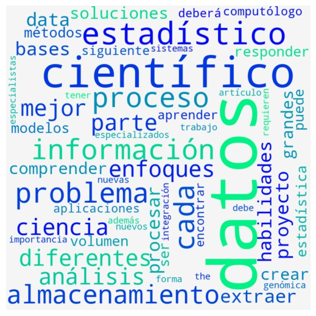

## Uso de word clouds

Una de las áreas más complejas que me tocado abordar es análisis de datos con formato de texto (text mining). 

Con el auge del almacenamiento de información han surgido diversas herramientas de analísis, en particular Natural Language Processing (NLP) es la que estudia diversos tipos de predicción de variables de este tipo, ejemplos de modelos de este tipo es el análisis de sentimientos, clasificación y traducción de idiomas.

El objetivo de este análisis es identificar palabras claves en el perfil de científico de datos, según wikipedia.

El foco de este repo es utlizar técnicas de limpieza y visualización en variables de este tipo. Para ello se realizaron los siguientes pasos:

1. Extraer input de data. Para ello me dirigí la pagina de wikipedia que habla de ciencia de datos [Ciencia de datos wikipedia](https://es.wikipedia.org/wiki/Ciencia_de_datos) y mediante técnicas de webscraping obtuvé el texto respecto al perfil de científico de datos ([punto 5 en el índice del artículo](https://es.wikipedia.org/wiki/Ciencia_de_datos#Cient%C3%ADfico_de_datos)).

2. Con el texto como input, se procede a limpieza de información. Se remueven caracteres no alfanuméricos, nombres propios, y palabras conectoras como preposiciones y/o adverbios.

3. Implementar una visualización, siendo las palabras de mayor tamaño las que se repiten más veces en el texto, y las más pequeñas las que tienen menos repeticiones; en este desarrollo se utilizó la libreria wordcloud.

El resultado del análisis es el siguiente

Como se observa en la gráfica, las palabras más importantes son datos, científico, estadístico, proceso, información, almacenamiento y problema. 

Nota: en este diagrama se logra distinguir las palabras estadístico y estadística. Dado el contexto del artículo, estadístico se refiere a la profesión y estadística a la ciencia de análisis; inclusive aparece la palabra computólogo, que mismo wikipedia explica en un link adicional.